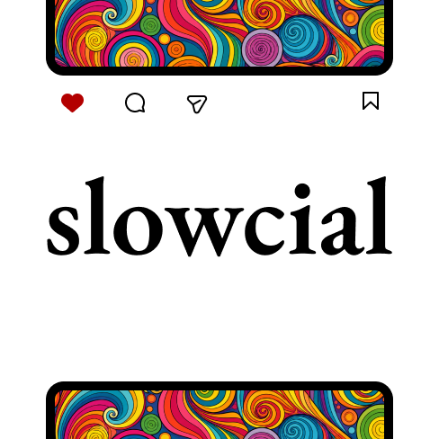

# Slowcial

<p align="center">
  
</p>

**An experimental Firefox extension that inserts viewport-sized space between Instagram posts to interrupt automatic infinite scrolling.**

Slowcial does not block social media. It changes the geometry of the feed: configurable gaps (`1×` / `1.5×` / `2×` viewport height) between posts, plus a lightweight session widget for elapsed time and posts you’ve actually centered in view.

---

## Why it exists

Infinite feeds compress item-to-item distance until scrolling becomes reflexive. Most interventions either lock the site or frame the problem as wellness. This project tests a narrower frontend hypothesis: **keep the content, change the spacing**, and see whether deliberate friction is enough to surface intention again.

Built as a compact portfolio case study in browser-extension engineering — dynamic third-party DOMs, observer lifecycle, injected UI isolation, and restrained product UX.

---

## What it does today

| Capability | Status |
|---|---|
| Instagram feed spacing via injected CSS | Working |
| Gap presets: `1×`, `1.5×`, `2×` viewport | Working |
| Enable / disable from popup | Working |
| Settings via `browser.storage.sync` | Working |
| Session widget: posts viewed + elapsed time | Working |
| Widget minimize + persist | Working |
| Firefox MV3 temporary install | Working |
| Chrome / Safari / store release | Not in scope yet |
| Multi-network adapters | Roadmap only |

> Honest scope: Instagram’s markup moves. Selectors are conservative and may need updates when Meta ships UI changes.

---

## Demo

Landing page (static): open [`site/index.html`](./site/index.html) or serve the `site/` folder.

```bash
# from repo root
python3 -m http.server 4173 --directory site
# → http://localhost:4173
```

Logo: [`assets/slowcial-logo.png`](./assets/slowcial-logo.png) / [`assets/slowcial-logo.svg`](./assets/slowcial-logo.svg) · site + extension icons are derived copies.

---

## How it works

```
Instagram DOM
  → content script (content.js)
    → inject / refresh spacing CSS
    → inject session widget
    → scroll/resize (+ interval) → centered-article detection
    → WeakSet dedupe → viewed count
  → popup UI writes settings
  → browser.storage.sync
  → storage.onChanged → re-apply
  → MutationObserver → rehydrate if SPA removes injected nodes
```

**Interesting frontend problems this touches:**

1. **Augmenting a hostile/moving DOM** — Instagram is an SPA; article nodes come and go. Spacing uses targeted selectors (`main article > div:first-child` when possible) rather than rewriting the feed.
2. **Idempotent lifecycle** — style tag + widget are upserted by ID; removal is watched once; storage listeners and scroll handlers attach once.
3. **Counting without double-counting** — centered article heuristic + `WeakSet` + `data-slowcial-viewed` attribute.
4. **Performance on scroll** — scroll/resize handlers coalesce through `requestAnimationFrame`; a low-frequency interval catches edge cases.
5. **Minimal privileges** — `storage` + `https://www.instagram.com/*` only. No telemetry, no content upload, no account APIs.

---

## Repository layout

```
extension/          Firefox MV3 add-on (load this folder)
  manifest.json
  content.js        Feed spacing + session widget
  popup.html|js     Gap + enable controls
  icons/            Toolbar PNGs derived from assets/slowcial-logo.png
site/               Static showcase landing page
  index.html
  styles.css
  assets/
docs/               Briefs / notes
SHOWCASE_STATUS.md  What’s demo-ready vs experimental
```

---

## Install locally (Firefox)

1. Clone this repo.
2. Open `about:debugging#/runtime/this-firefox`.
3. **Load Temporary Add-on…** → select `extension/manifest.json`.
4. Visit Instagram → open the Slowcial popup → pick a gap → scroll the home feed.

Temporary add-ons unload when Firefox restarts. That’s expected for this stage.

### Manual verification

- [ ] Popup enable toggle immediately adds/removes feed gaps
- [ ] Gap select switches between 1 / 1.5 / 2 viewport multiples
- [ ] Session widget appears; viewed count increments when a post is centered
- [ ] Minimize state survives reload (storage.sync)
- [ ] Navigating within Instagram does not duplicate the widget
- [ ] Disabling leaves the host page usable (no broken layout)

---

## Current limitations

- Instagram-only; selectors can break when Meta changes markup
- Firefox-first; not packaged for AMO / Chrome Web Store yet
- Temporary-addon workflow only
- No automated browser tests against live Instagram (fragile + account-bound)

---

## Near-term roadmap

- Capture portfolio screenshots / short GIF of real spacing behaviour
- Optional: extract pure helpers (gap CSS, duration format, dedupe) for unit tests
- Optional: Chrome MV3 pass once Firefox path is stable

---

## Privacy

Slowcial stores only local extension settings (`enabled`, gap mode, widget minimized). It does not collect browsing content, scrape posts, or phone home.

---

## CV / portfolio one-liner

> *Slowcial — experimental Firefox extension that injects viewport-scaled spacing into Instagram feeds and tracks session visibility with content-script observers; a small study in third-party DOM augmentation, SPA lifecycle hygiene, and intentional interaction friction.*
